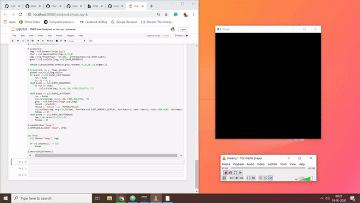

# draw_emnist

This repository contains code that enables users to hand-draw and classify alphabets (a-z) using deep learning. This model is trained using the EMNIST data set.


## Install Dependencies 

The following bash code will install all the necessary dependencies.

```bash
pip install -r requirements.txt
```

## Usage

If you're using the **pre-trained model**, then follow these steps.

```bash
git clone https://github.com/mukeshiyer237/draw_emnist.git
cd draw_emnit
jupyter notebook main.ipynb
```

Run the last three cells of the notebook and you'll get the following output.


(Use **Esc** button to close the window.)


If you wist to train your own model, then run all the cells in the notebook. (I'd suggest you to use google colab's gpu to train the model as the dataset is quite huge)

